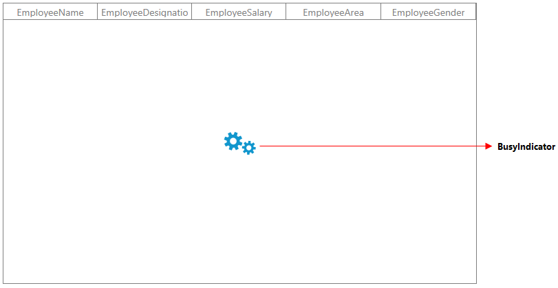

# How to show the busy indicator while loading the data in the WPF SfDataGrid?

You can show an indication of the data loading with the help of the  [BusyIndicator](https://www.syncfusion.com/wpf-controls/busy-indicator) while in the [WPF DataGrid](https://www.syncfusion.com/wpf-controls/datagrid). You can display the BusyIndicator by setting the [BusyIndicator.IsBusy](https://help.syncfusion.com/cr/wpf/Syncfusion.Windows.Tools.Controls.BusyIndicator.html#Syncfusion_Windows_Tools_Controls_BusyIndicator_IsBusy) to true when loading the data. Once loaded, you can stop it by setting the BusyIndicator.IsBusy to false by handling the [ItemsSourceChanged](https://help.syncfusion.com/cr/wpf/Syncfusion.UI.Xaml.Grid.SfDataGrid.html#Syncfusion_UI_Xaml_Grid_SfDataGrid_ItemsSourceChanged) event of the SfDataGrid.

You can show an indication of the data loading with the help of the BusyIndicator while in the WPF DataGrid. You can display the BusyIndicator by setting the BusyIndicator.IsBusy to true when loading the data. Once loaded, you can stop it by setting the BusyIndicator.IsBusy to false by handling the ItemsSourceChanged event of the SfDataGrid.

```xaml
<Syncfusion:SfBusyIndicator Name="sfBusyIndicator"
                            IsBusy="True"
                            VerticalAlignment="Center"
                            AnimationType="Gear">
</Syncfusion:SfBusyIndicator>
 ```

Here, the BusyIndicator is stopped after the [SfDataGrid.ItemsSource](https://help.syncfusion.com/cr/wpf/Syncfusion.UI.Xaml.Grid.SfDataGrid.html#Syncfusion_UI_Xaml_Grid_SfDataGrid_ItemsSource) is changed by handling the ItemsSourceChanged event.

**C#**
 
 ```csharp
SfdataGrid.Loaded += SfdataGrid_Loaded;

SfdataGrid.ItemsSourceChanged += SfdataGrid_ItemsSourceChanged;

async void SfdataGrid_Loaded(object sender, RoutedEventArgs e)
{
    this.SfdataGrid.ItemsSource = await (this.DataContext as ViewModel).GetRecords();
}

void SfdataGrid_ItemsSourceChanged(object sender, GridItemsSourceChangedEventArgs e)
{
    sfBusyIndicator.IsBusy = false;
}
  ```

The following screenshot shows the BusyIndictor before loading the data into the view.

